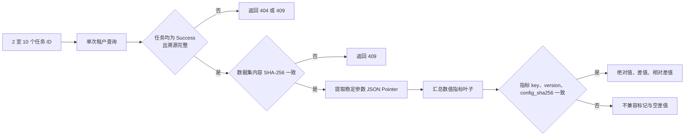
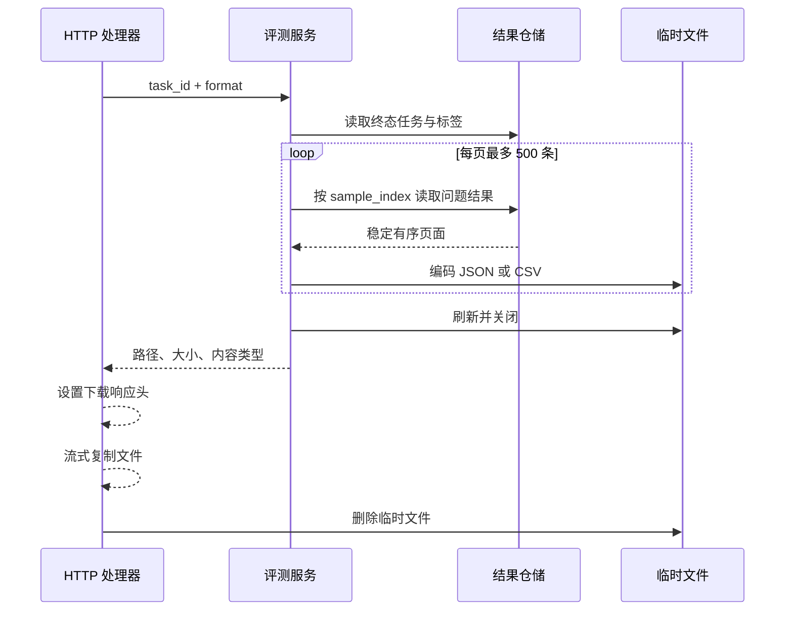

# M4 实验对比与导出集成契约

里程碑 4（Milestone 4，M4）在 `integration/evaluation-m4-comparison-export` 分支提供实验查询、标签、
运行对比、审计导出和实验工作台。系统直接读取冻结实验清单、聚合指标和逐问题事实，不执行指标重算。

## 1. 查询与标签

实验运行列表按 `(start_time DESC, id DESC)` 使用不透明键集游标分页。一次查询最多接受 5 个重复 `label`
参数，并支持状态、数据集 ID、数据集版本 ID、模型 ID、开始时间下界和开始时间上界。游标绑定全部筛选条件，
因此后续页只能在相同筛选集合中继续读取。

`evaluation_task_labels` 使用 `(tenant_id, task_id, label)` 复合主键。标签进入数据库前执行空白清理和小写规范化；
单个任务最多保存 20 个标签，每个标签最多 64 个 8 位统一码转换格式（8-bit Unicode Transformation Format，
UTF-8）字节。标签替换在一个数据库事务中删除现有集合并写入新集合，同时保持任务业务版本与更新时间不变。

PostgreSQL 迁移 `000097` 与 SQLite 迁移 `000020` 创建标签表、租户查询索引和级联外键。任务物理删除通过
`ON DELETE CASCADE` 同步删除标签。

## 2. 运行对比

对比请求接受 2 至 10 个稳定去重的任务 ID。基线任务默认取请求中的第一个任务，也可以通过
`baseline_task_id` 显式指定。服务层使用一次租户条件查询读取全部任务；缺失、跨租户和应用程序编程接口密钥
（Application Programming Interface Key，API Key）范围外的任务统一使用 NotFound 语义。

下图展示运行对比的数据校验与计算流程。该流程先验证冻结事实，再构造参数和指标矩阵。

图中的安全哈希算法 256 位（Secure Hash Algorithm 256-bit，SHA-256）校验保证所有运行使用相同数据集内容。
参数矩阵只读取 `/dataset`、`/models`、`/configuration/retrieval`、`/configuration/rerank`、
`/configuration/generation` 和 `/metric_plan` 六个稳定根节点，并使用 JavaScript 对象表示法指针
（JavaScript Object Notation Pointer，JSON Pointer）标识叶子。

指标矩阵取所有聚合结果中的数值叶子并按指针排序。指标身份由 `key`、`version` 和 `config_sha256` 组成。
身份一致时返回绝对值、相对基线的差值和相对差值；基线值为零时，相对差值为 `null`，原因固定为
`baseline_value_is_zero`。身份缺失或不一致时，指标标记为不兼容，差值保持 `null`。响应不推导
“提升”或“回退”等方向性评价。

## 3. 审计导出

成功、失败、超时、中断和取消五类稳定终态可以导出。Pending 与 Running 返回超文本传输协议
（Hypertext Transfer Protocol，HTTP）409。失败类终态导出已经持久化的逐问题记录，使部分运行仍可审计。

导出支持 JavaScript 对象表示法（JavaScript Object Notation，JSON）和逗号分隔值
（Comma-Separated Values，CSV）。JSON 使用固定 schema version 1，包含任务、标签、冻结实验清单、聚合指标和
逐问题结果。CSV 使用固定列集合，并以 `run` 与 `question` 两种记录类型承载同一信息。用户文本和复杂值写成
JSON 字面量，电子表格公式样式文本不会成为 CSV 公式。

下图展示导出文件的有界构建与传输顺序。临时文件完整关闭后，处理器才设置下载响应头。

图中的分页循环最多处理 50,000 条问题记录，文件上限为 256 MiB。计数超限、字节超限、编码失败、上下文取消和
文件关闭失败都会清理临时文件。文件传输阶段不持有数据库事务。Go 软件开发工具包（Software Development Kit，
SDK）通过流式响应与 `io.Copy` 写入调用方目标，不使用整文件内存读取，也不继承通用 30 秒请求超时。

## 4. 实验工作台

前端路由 `/platform/evaluations` 提供实验工作台。页面包含状态、数据集、版本、模型、时间范围和重复标签筛选；
左侧运行浏览器使用键集游标加载后续页面，右侧显示任务状态、进度、溯源完整性、冻结实验、聚合指标和逐问题事实。

用户可以选择 2 至 10 个运行并指定基线。参数表和指标卡直接呈现服务端对比响应，浏览器不重新计算指标。
管理员可以原子替换标签；查看者可以查询、对比和下载稳定终态导出。页面提供英语、简体中文、俄语和韩语词条，
并在窄屏宽度下转换为纵向布局。

## 5. API、权限与 SDK

下表列出 M4 的公开入口。表中的 Viewer 表示查看者角色，Admin 表示管理员角色；API Key 需要
`run_evaluations` 能力。

| 能力 | API | 角色 | Go SDK |
| --- | --- | --- | --- |
| 筛选运行 | `GET /api/v1/evaluation/tasks` | Viewer | `ListEvaluations` |
| 替换标签 | `PUT /api/v1/evaluation/tasks/:task_id/labels` | Admin | `ReplaceEvaluationLabels` |
| 对比运行 | `POST /api/v1/evaluation/comparisons` | Viewer | `CompareEvaluations` |
| 导出审计文件 | `GET /api/v1/evaluation/tasks/:task_id/export` | Viewer | `ExportEvaluation` |

表中的查询、对比和导出均使用冻结实验清单中的来源知识库 ID 执行 API Key 允许列表判断。来源为空、来源不完整或
超出允许范围时返回 NotFound 语义。标签替换只接受 JSON Web Token（JSON Web Token，JWT）管理员会话。

## 6. 验证门禁

M4 分支通过以下验证集合：

| 验证对象 | 结果 |
| --- | --- |
| 根 Go 模块全量测试 | `go test ./... -count=1` 通过，包含 PostgreSQL 仓储和双数据库迁移往返 |
| Go SDK 模块 | 全量测试与 `go vet ./...` 通过 |
| 竞态检测 | M4 仓储、服务、处理器、路由、数据库及 SDK 通过 `go test -race` |
| 静态分析 | `golangci-lint v2.12.2` 相对 M3 基线为 0 issues |
| 前端 | 513 项测试、`vue-tsc --build` 和 Vite 生产构建通过 |
| Git 完整性 | 提交对象可读取，工作区差异检查通过 |

该验证集合覆盖查询游标绑定、标签原子替换、单查询对比、指标兼容性、零基线、终态导出、部分结果、文件上限、
临时文件清理、API Key 范围、四语词条一致性和生产资源构建。
