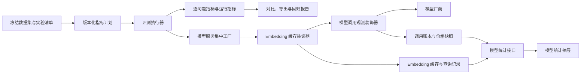

# M5 指标、模型观测、缓存与性能集成契约

里程碑 5（Milestone 5，M5）在 `integration/evaluation-m5-observability-performance` 分支提供版本化指标、
评测运行观测、模型调用账本、嵌入向量（Embedding）持久缓存、模型统计、统计区间、人工评分、确定性回归和隔离性能基线。
M5 直接消费里程碑 3（Milestone 3，M3）的冻结实验与逐问题事实，并保持里程碑 4（Milestone 4，M4）的查询、标签、
对比和导出协议。

## 1. 评测与模型观测形成同一条事实链

下图展示评测请求从冻结配置进入指标计算、模型装饰器、持久事实和用户界面的数据流。每个箭头表示当前代码中的
直接调用或持久化关系。

图中的评测执行器将动态指标观测写入逐问题事实，同时聚合阶段耗时、样本状态和 Token。Embedding 缓存位于模型调用
观测装饰器外层，因此缓存命中只产生缓存查询记录；缓存缺失或绕过进入厂商调用并产生调用账本。模型统计接口分别从
调用账本和缓存查询记录计算厂商缓存与应用缓存口径。

## 2. 版本化指标注册表

指标注册表使用 `(key, version)` 作为注册键。重复键使注册表构造失败。每个定义包含指标类别、描述、默认配置和
JavaScript 对象表示法（JavaScript Object Notation，JSON）配置 schema。任务创建时，注册表使用 M3 规范序列化协议
生成 `EvaluationMetricPlanSnapshot` 和 `EvaluationMetricSpecSnapshot`；指标实例 ID 为
`key@version#config_sha256`。

默认计划包含 12 个实例：Precision、Recall、NDCG@3、NDCG@10、MRR、MAP、BLEU-1、BLEU-2、BLEU-4、
ROUGE-1、ROUGE-2 和 ROUGE-L。新增插件通过注册接口进入动态 `scores`，无需修改评测调度分支。必需指标失败使任务
失败；可选指标保留 `failed` 观测与错误码。固定字段继续映射默认 12 项，供现有消费者读取。

## 3. 运行指标与模型调用账本

`EvaluationRuntimeMetrics` schema version 1 保存数据集加载、索引、执行、持久化、清理和总耗时。持续时间使用单调时钟
计算毫秒值。样本计数区分 started、success、failed、canceled、interrupted 和 not_started；失败率保存明确的分子与
分母。Token 汇总同时记录可报告与不可报告样本数。

模型服务集中工厂为 Chat、Embedding、Rerank、视觉语言模型（Vision-Language Model，VLM）和自动语音识别
（Automatic Speech Recognition，ASR）安装调用观测装饰器。`model_call_records` 在请求前写入 started，并在成功、
错误和取消路径写入一个终态。流式 Chat 使用 `sync.Once` 合并正常结束、上游错误、调用者关闭和上下文取消路径。
账本保存模型快照、用途、操作、时间、Token、缓存口径、价格快照和费用，不保存提示词、文档内容、媒体内容、密钥或授权头。

评测上下文采用严格记账，账本开始记录失败会阻止模型请求。普通交互采用尽力记账。价格版本按租户、模型和有效区间
保存；区间重叠被拒绝。调用开始时解析有效价格并冻结整数微货币单价。费用使用大整数中间值和 half-up 舍入；缺少价格或
用量时 `cost_microunits` 为 `null`，`accounting_complete` 为 false。

## 4. Embedding 持久缓存与查询记录

缓存复合主键为 `tenant_id + model_id + model_fingerprint + request_options_sha256 + text_sha256`。文本使用原始
8 位统一码转换格式（8-bit Unicode Transformation Format，UTF-8）字节计算安全哈希算法 256 位
（Secure Hash Algorithm 256-bit，SHA-256）。模型指纹只包含影响行为的配置和自定义头名称。向量以 little-endian
float32 二进制保存，PostgreSQL 使用 BYTEA，SQLite 使用 BLOB。

`BatchEmbed` 对批内文本去重，批量读取缓存，只将缺失项发送给厂商，并按输入顺序恢复结果。写入前校验数量、维度、
SHA-256 校验和以及 NaN、Inf 等非有限数。进程内 singleflight 和数据库唯一键共同抑制重复。缓存仓储故障产生 bypass
查询记录并继续调用厂商。

`embedding_cache_lookup_records` 每次保存 requested、unique、hit、miss、bypass、status、duration 和发生时间。
数据库约束保证 `hit + miss + bypass = unique`，并校验 hit、miss、partial、bypass 四种状态。记录不包含原始文本、
文本哈希或向量。缓存默认有效期为 30 天，清理周期为 24 小时，每批 500 行，每轮最长 30 秒。

## 5. 模型统计、区间与人工评分

模型统计以租户、模型集合和协调世界时（Coordinated Universal Time，UTC）半开区间查询。调用统计包含状态、Token、
费用、未定价数、平均耗时和 p50、p95、p99 延迟。厂商缓存命中率以厂商报告的 read 与 miss Token 为分母；Embedding
应用缓存命中率以缓存查询的 hit 与 miss 项为分母，bypass 查询数独立返回。模型统计抽屉提供 7、30、90 天范围、模型
调用量、Token、费用、两类缓存和三个延迟分位数。管理员可以创建价格版本，查看者可以读取统计和价格。

对比响应中的普通逐样本指标使用固定 seed、2,000 次非参数 bootstrap 百分位置信区间；问题成功率使用 Wilson 区间。
有效样本少于 2 个时返回 `insufficient_sample`，并保留 `n_total`、`n_valid` 和 `n_missing`。延迟返回 p50、p95、
p99；Token 总和保持加法事实。

语义裁判实现为非默认指标插件，配置冻结裁判模型、提示词版本及哈希、温度、seed 和重试次数。人工评分保存在
`evaluation_human_ratings`，按照任务、样本和 rubric 追加修订；`supersedes_id` 连接同一 rubric 的修订链。

## 6. 回归与性能入口

`make evaluation-reproduce` 在无外部密钥环境运行 golden-v1 固定数据集和确定性替身流水线。权威 JSON 包含数据集
哈希、提交、解析配置、指标计划、13 项指标和环境摘要；Markdown 由同一 JSON 对象生成。版本化阈值位于
`evaluation/regression/thresholds.json`。退化超过阈值时命令返回 1，并输出指标、基线、当前值、绝对差和阈值。

持续集成（Continuous Integration，CI）工作流在拉取请求、定时和手动触发时执行同一命令。性能工作流按定时和手动
触发运行隔离基准。性能矩阵覆盖 10、100、1,000 个样本，并发度 1、4、8，冷缓存与热缓存各重复 5 次；微基准覆盖
指标计算、聚合、逐题持久化、列表、对比和导出。性能 JSON 是权威结果，Markdown 从 JSON 生成。拉取请求不使用单次
wall time 作为阻断条件。

## 7. API、权限与 SDK

应用程序编程接口（Application Programming Interface，API）和 Go 软件开发工具包
（Software Development Kit，SDK）入口如下。Viewer 表示查看者角色，Admin 表示管理员角色。

| 能力 | API | 角色 | Go SDK |
| --- | --- | --- | --- |
| 指标目录 | `GET /api/v1/evaluation/metrics` | Viewer / `run_evaluations` API Key | `ListEvaluationMetrics` |
| 单模型统计 | `GET /api/v1/models/:id/usage` | Viewer | `GetModelUsage` |
| 多模型统计 | `GET /api/v1/models/usage` | Viewer | `ListModelUsage` |
| 价格版本 | `GET /api/v1/models/:id/pricing` | Viewer | `ListModelPrices` |
| 创建价格版本 | `PUT /api/v1/models/:id/pricing` | Admin | `PutModelPrice` |
| 人工评分修订 | `GET /api/v1/evaluation/tasks/:task_id/questions/:sample_index/ratings` | Viewer | `ListEvaluationHumanRatings` |
| 追加人工评分 | `POST /api/v1/evaluation/tasks/:task_id/questions/:sample_index/ratings` | Admin | `AppendEvaluationHumanRating` |

表中的模型统计和价格查询按租户隔离。指标目录沿用评测 API Key 能力。人工评分读取沿用任务可见性，写入要求管理员角色。

## 8. 连续迁移分配

运行指标使用独立 JSON 列，因此占用首个迁移号。当前连续分配如下。

| PostgreSQL | SQLite | 目标 |
| --- | --- | --- |
| `000098` | `000021` | 任务运行指标与逐问题阶段耗时 |
| `000099` | `000022` | 模型调用账本与价格版本 |
| `000100` | `000023` | Embedding 向量缓存 |
| `000101` | `000024` | 缓存查询记录与统计索引 |
| `000102` | `000025` | 人工评分追加修订 |

PostgreSQL 与 SQLite 使用相同业务约束；数据库专用迁移分别定义 JSONB/JSON、BYTEA/BLOB 和时间类型。

## 9. 验证边界

M5 定向单元测试、双数据库迁移、Go SDK、前端测试、国际化检查、类型检查、生产构建、`go vet`、服务器构建、
Compose 配置、竞态检测和相对 M4 锚点的 `golangci-lint` 均纳入组合门禁。性能基线同时验证持久化、列表、对比、导出和
缓存计数守恒。

无密钥环境能够验证 Embedding 冷热缓存：相同语料的第二次索引构建向厂商发送 0 个输入项。当前环境没有可报告
Wiki 厂商缓存的 live provider，因此 Wiki live 结果为 `unavailable`；确定性适配器验证 reported、hit、miss 和 bypass
统计链。语义裁判和收费外部模型的 live 实测需要相应模型、凭据和费用预算。
