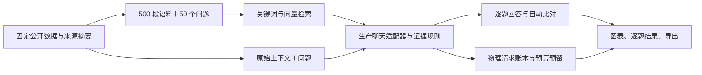
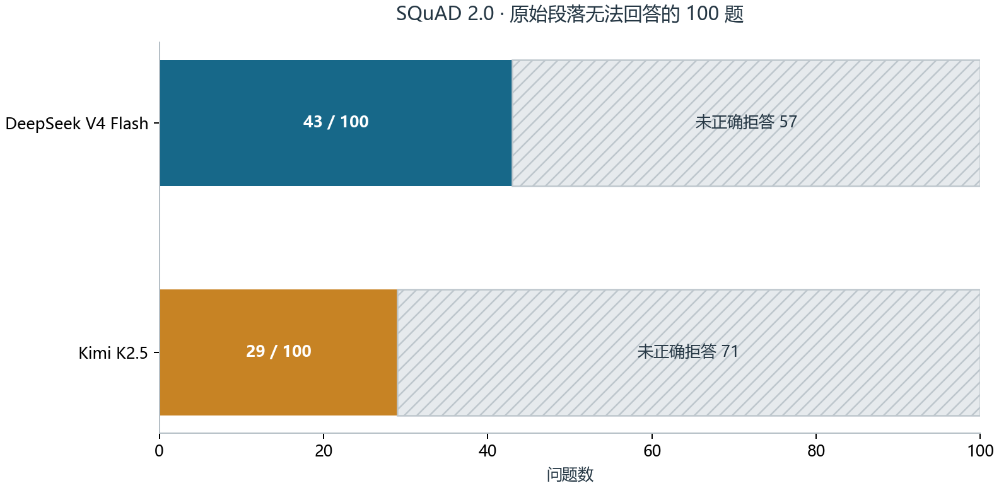
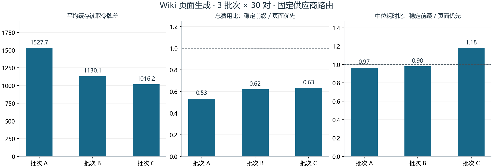
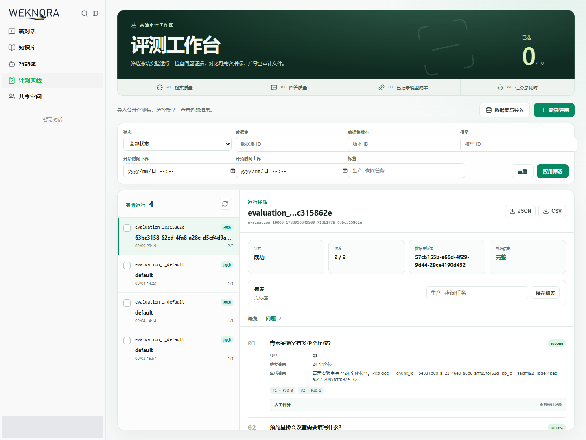

# 扩展验收实测报告

系统提供固定数据评测、逐题证据、供应商用量账本、持久化向量缓存、页面生成和一键启动。验收证据包括 1,200 份原始上下文回答、200 条完整检索流程结果、90 组页面生成配对数据及 12 项真实浏览器检查。人工评分字段为空。

## 系统与验证范围

检索增强生成（Retrieval-Augmented Generation，RAG）流程从固定数据版本读取段落和问题，建立关键词与向量索引，融合检索结果，再调用所选模型生成答案。每次供应商物理请求写入调用账本，评测任务聚合检索、延迟、用量和费用数据。结构化文本格式 JSON（JavaScript Object Notation）与逗号分隔值格式 CSV（Comma-Separated Values）导出保存一致的运行指标。

下图展示两类质量实验的输入路径和共享观测模块。

原始上下文实验衡量模型从已提供材料回答问题的能力。完整流程实验经过超文本传输协议（Hypertext Transfer Protocol，HTTP）接口，包含索引、检索、生成和任务落库。两类结果分别统计。

## 数据来源与质量

三个公开开发集共读取 22,497 题。结构、答案位置、支持句索引与重复标识检查保留 22,320 题，排除 177 题。来源为 [中文机器阅读理解数据集 CMRC2018（Chinese Machine Reading Comprehension 2018）](https://github.com/ymcui/cmrc2018)、[斯坦福问答数据集 SQuAD 2.0（Stanford Question Answering Dataset 2.0）](https://rajpurkar.github.io/SQuAD-explorer/)和[多跳问答数据集 HotpotQA](https://hotpotqa.github.io/)；HotpotQA 文件使用作者组织的[固定版本镜像](https://huggingface.co/datasets/hotpotqa/hotpot_qa/tree/1908d6afbbead072334abe2965f91bd2709910ab)。版本、许可文件、下载地址和 SHA-256 摘要见 [sources.json](sources.json)。SHA-256 是安全散列算法 256 位版本，用于验证文件内容一致性。

| 数据集 | 读取题数 | 有效题数 | 排除题数 | 调试样本 | 正式样本 |
| --- | ---: | ---: | ---: | ---: | ---: |
| 中文机器阅读理解 CMRC2018 | 3,219 | 3,043 | 176 | 32 | 200 |
| 斯坦福问答数据集 SQuAD 2.0 | 11,873 | 11,873 | 0 | 32 | 200 |
| 多跳问答数据集 HotpotQA | 7,405 | 7,404 | 1 | 32 | 200 |

固定种子为 `20260911-excellence-v1`。调试与正式样本的来源分组和上下文内容互不重叠，并排除前次 24 题实验已使用的上下文。正式样本包含 SQuAD 的 100 道可回答题与 100 道无答案题，以及 HotpotQA 的 100 道桥接题与 100 道比较题。公开开发集可能出现在模型预训练材料中；这些结果描述固定过滤子集，不能替代官方榜单成绩。

## 原始上下文回答

96 道调试题形成 192 份提示词对照输出，规则选择以预先保存的宏平均词元重合 F1（精确率与召回率的调和平均）和拒答条件为依据。正式集固定后，两个模型各回答 600 题，共完成 1,200 份输出和 1,211 次尝试。失败尝试保留于原始证据；6 份格式无效的回答按零分计入正式样本。

完全匹配（Exact Match，EM）衡量标准化答案是否与任一参考答案一致。F1 为词元重合的精确率与召回率的调和平均。英文采用 SQuAD 标准化规则，中文采用汉字与拉丁词分段；HotpotQA 的是非答案不匹配时计零。中文分词方案属于本实验口径。

| 数据集 | 模型 | 题数 | EM | F1 | F1 的 95% 区间 | 格式错误 |
| --- | --- | ---: | ---: | ---: | --- | ---: |
| CMRC2018 | DeepSeek V4 Flash | 200 | 68.5% | 90.6% | 87.9%–93.1% | 1 |
| CMRC2018 | Kimi K2.5 | 200 | 72.5% | 92.3% | 89.9%–94.6% | 1 |
| SQuAD 2.0 | DeepSeek V4 Flash | 200 | 55.5% | 62.8% | 55.3%–72.4% | 0 |
| SQuAD 2.0 | Kimi K2.5 | 200 | 50.0% | 57.1% | 52.0%–62.3% | 0 |
| HotpotQA | DeepSeek V4 Flash | 200 | 56.5% | 64.8% | 58.7%–70.8% | 0 |
| HotpotQA | Kimi K2.5 | 200 | 63.5% | 73.8% | 68.3%–79.1% | 4 |

下图给出点估计与来源分组重采样区间。

误差线使用 5,000 次来源分组自助重采样，固定种子为 20260911，取第 2.5 与第 97.5 百分位。SQuAD 正式集来自 12 个来源分组，同组题目存在关联。图中的区间描述该采样方案下的不确定性。原始回答、全部参考答案、自动得分和逐条成功调用费用见 [reader-scores.json](reader-scores.json)。

下图展示 SQuAD 原始段落无答案题的拒答结果。

DeepSeek V4 Flash 正确拒答 43/100，Kimi K2.5 正确拒答 29/100。证据不足时给出答案是当前可测量的质量弱项。这里的无答案标签适用于原始段落；合并语料后的可回答性需要独立判断。

## 完整检索流程

每个数据集使用 500 个真实段落与 50 道可回答问题，每个模型完成一轮。相关性标签标记问题的原始证据段落，语料中可能存在其他语义相关段落。召回率按这些固定标签计算；归一化折损累计增益前三位（Normalized Discounted Cumulative Gain at 3，NDCG@3）衡量前三项的排序质量。费用单位为美元（United States Dollar，USD）。

| 数据集 | 模型 | 问题 / 段落 | 召回率 | NDCG@3 | 已知费用 USD | 费用未知尝试 | 空输出 |
| --- | --- | ---: | ---: | ---: | ---: | ---: | ---: |
| CMRC | DeepSeek V4 Flash | 50 / 500 | 100.0% | 0.9800 | 0.019700 | 2 | 1 |
| CMRC | Kimi K2.5 | 50 / 500 | 100.0% | 0.9800 | 0.078785 | 0 | 0 |
| SQUAD | DeepSeek V4 Flash | 50 / 500 | 98.0% | 0.9305 | 0.011947 | 0 | 0 |
| SQUAD | Kimi K2.5 | 50 / 500 | 98.0% | 0.9305 | 0.063861 | 0 | 0 |

供应商嵌入批次包含 5 段，嵌入模型与执行池并发均为 4。CMRC 的 DeepSeek 任务使用 1 个问题工作线程，其余任务使用 4 个；运行资源差异限制了任务总耗时的直接比较。每个评测任务均核对数据库、详情接口、JSON 与 CSV 的运行指标。成功调用费用按供应商收据逐条转换为百万分之一美元并核对总和；网络失败或供应商未报告用量时，未知金额保持空值。空输出按零分计入自动质量指标，表中的空输出列保留其数量。

持久化向量缓存按租户、模型、行为参数和文本内容区分条目。池化嵌入每 64 段保存一轮进度，后续窗口失败时已保存窗口可供重试使用。真实 500 段索引在末个窗口失败后，前 448 段全部命中缓存，剩余 52 段重新请求；成功收据中的重复输入为 47 段，详见 [cache-recovery.json](cache-recovery.json)。500 段单元回归同时覆盖新建缓存协调器后的存储复用、重复文本顺序、返回向量独立性及取消停止后续调用。五组真实冷启动与进程重启对照、内容修改探测见[缓存实测证据](../final-acceptance/README.md)。

## 页面生成缓存、费用与耗时

Wiki 知识页面生成使用 DeepSeek V4 Flash，固定供应商路由 `gmicloud/fp8`。每批 30 对请求交替安排稳定前缀与页面优先两种布局；批次 B、C 通过不同批次标识区分共享前缀，批次 A 的原始前缀保存在其固定方案中。四项自动字符串检查覆盖座位数、目录项、开放时间和每日开放措辞；否定语境也可能触发字符串匹配，这些检查不能替代语义核验。

| 批次 | 配对数 | 缓存读取令牌平均差 | 总费用比 | 中位耗时比 | 四项全通过：稳定 / 页面 |
| --- | ---: | ---: | ---: | ---: | --- |
| A | 30 | 1527.7（30/30） | 0.533 | 0.966 | 22/30 / 25/30 |
| B | 30 | 1130.1（30/30） | 0.619 | 0.979 | 23/30 / 23/30 |
| C | 30 | 1016.2（30/30） | 0.631 | 1.178 | 19/30 / 22/30 |

缓存令牌差为稳定前缀减页面优先；两项比值均为稳定前缀除以页面优先。下图按批次展示这三个指标。

三批稳定前缀总费用分别为对照的 53.3%、61.9%、63.1%，中位耗时比分别为 0.97、0.98、1.18。固定路由下三批均观察到成本下降，第三批的中位耗时增加。同批请求共享供应商缓存状态，配对样本不能视为完全独立。四项自动字符串检查属于有限规则覆盖。逐对数据见 [wiki-pairs.json](wiki-pairs.json)。

## 工程与页面验收

真实浏览器完成 12 项检查：四类指标、JSON 下载、CSV 下载、逐题证据、状态与数据集筛选、空结果、筛选复位、设置页单一弹层、延迟与缓存缺失值、模型筛选、自定义时间范围和页面异常。下图展示逐题回答与检索证据。

页面截图来自本机两个合成问题的固定演示任务，用于验证界面行为。大规模质量结论来自上述独立数据实验。

文件写入同时检查复制与关闭错误；配置读取拒绝无效展开内容；批量知识访问传播数据库错误并处理空代理；审批订阅退避在接收实际消息后复位。对应回归测试通过；增量静态检查覆盖 `80a938a0` 至 `d0535cdf` 的变更，结果为 0 项。项目全量根模块静态扫描记录 5,923 项发现，其内容含代码格式、长行、错误处理与静态分析建议；全量扫描状态与本轮增量状态分别保存，不能据增量通过宣称全仓检查通过。

固定评测门禁、持久化 HTTP 冷热缓存、取消、重复取消、进程终止与执行租约恢复均保留零费用回归证据。[交付变更](https://github.com/Aokiuuz/WeKnora/pull/1)保存持续集成结果；[受控退化变更](https://github.com/Aokiuuz/WeKnora/pull/2)保存召回退化触发必需检查失败及阻断合并的证据。

## 版本、预算与复现

原始上下文探针源码提交为 `86436db4cecf13039b9a41ff8c78ac1fac8fff58`，探针摘要为 `f35f10bd048de4517377bc1f55a883c7a121885127c2b66f9a4e735d520bf4dd`。个人服务验收快照记录的源码提交为 `db56f0d98464b7bd3282e5e0e6ce0c26c619720f`。完整检索任务的构建标识见 [summary.json](summary.json)，各实验保留实际执行二进制的来源，不以报告提交代替实验提交。

Apple M4 工程复现使用提交 `1776aa442a491f1657196ca21da914bab197b17c`。提供的独立证据包汇总记录两次新建数据库运行和 988 项一致性检查通过，证据审阅范围见本机交付索引。当前扩展实验在 Linux 操作系统的 64 位 x86（amd64）环境执行，M4 记录的适用范围以其提交标识为准。

模型累计预算为 20 美元，当前供应商已报告费用 `0.922374105923` 美元，未结算调用保守预留 `0.728884` 美元，共 `2964` 次预算记录。预算覆盖本轮、前次实验和失败重试。每次出站调用先预留成本，已知费用按实际结算，未知费用继续占用预算；文件锁阻止两个付费执行器同时使用该预算文件。

数据准备、质量评分、HTTP 执行与报告生成脚本位于 `scripts/prepare-expanded-evaluation.py`、`scripts/prepare-expanded-retrieval.py`、`scripts/evaluation-expanded-reader.py`、`scripts/evaluation-expanded-http.py` 和 `scripts/build-excellence-report.py`。付费脚本在隔离 Linux 容器中从标准输入接收凭据，共用同一预算文件。数据库运行于容器内部，应用停止后导出一致性备份。失败批次 `http-01`、`http-02` 保留中止原因和费用，不参与有效质量汇总。

本机一键启动入口、模型查看、现有演示任务与导出步骤见[验收演示索引](../../acceptance-demo.md)。人工评分与人工主观质量结论均未生成。
