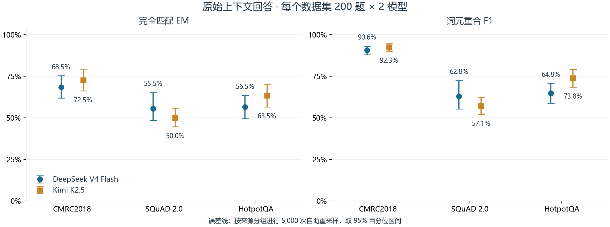

# 扩展验收数据

原始上下文评测已保存 1,200 份回答，覆盖 CMRC2018、SQuAD 2.0 和 HotpotQA 各 200 道问题与两个模型。完整检索流程和跨批次页面生成实验正在运行，当前目录保存已完成的读者组件证据。

完全匹配（Exact Match，EM）衡量标准化答案是否匹配任一参考答案。F1 为词元重合精确率与召回率的调和平均。下图给出两个模型的点估计与按来源分组计算的 95% 区间。

中文问题的 F1 为 90.6% 和 92.3%；无答案题的正确拒答分别为 43/100 和 29/100。原始回答、参考答案和自动得分见 [reader-scores.json](reader-scores.json)，统计口径与来源构建见 [reader-summary.json](reader-summary.json)。人工评分字段为空。
