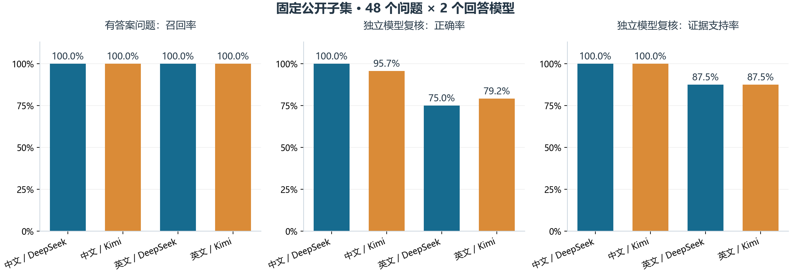
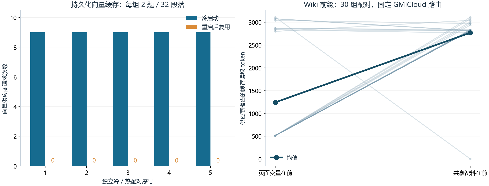
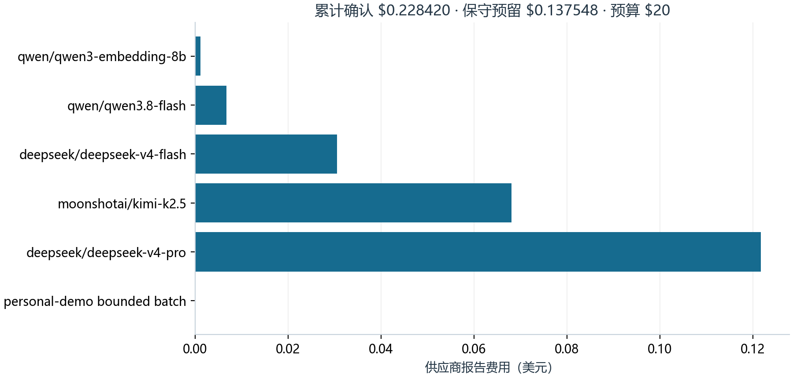

# WeKnora 课题三验收报告

系统提供固定数据评测、模型调用账本、持久化向量缓存与回归门禁。真实实验包含 96 份公开数据回答、五组服务重启缓存对照、30 组 Wiki 前缀对照和 48 组匿名答案自动复核。个人服务保留可打开的合成资料知识库与两题评测记录。

## 1. 运行与数据流

个人服务由 PostgreSQL 数据库、Redis 缓存和队列、DocReader 文档解析、WeKnora 后端及网页组成。应用程序编程接口（Application Programming Interface，API）通过本机端口 18080 提供服务，网页入口为 `http://127.0.0.1:5174`。双击项目外层的 `启动WeKnora.cmd` 启动完整服务。

评测任务固定数据版本、模型配置、分块策略、检索参数及指标算法版本。每次供应商调用先写入起始记录，收到结果后保存用量、费用与终态。OpenRouter 报告的十进制美元费用按四舍五入转换为微美元，同时保留原始金额和价格估算值。服务意外终止时，未确定的费用继续保持未确定状态。

## 2. 真实回答质量

中文阅读理解数据集 CMRC2018（Chinese Machine Reading Comprehension 2018）与斯坦福问答数据集 SQuAD2（Stanford Question Answering Dataset 2.0）各使用 24 个问题、32 个候选段落的固定开发集子集。SQuAD2 子集包含 16 个有答案问题和 8 个无答案问题。两个回答模型使用相同数据、向量模型与检索配置；生成温度为 0，输出上限为 512 个 token。

图 1 展示有答案问题的召回率和独立模型复核结果。召回率衡量相关段落是否进入检索结果；自动复核分别判断回答正确性与事实是否获得所提供段落支持。

图中自动复核由 DeepSeek V4 Pro 执行，答案匿名化为 A、B，并按题目交替交换顺序。模型辅助评分与人工评分分别保存。单个自动评分者可能存在判断误差及模型家族偏好，人工评分字段保持空值。有效评分覆盖 47/48 组；格式无效的评分保留原始输出并排除出比例的分母。

下表补充答案词序重合指标 ROUGE-L（Recall-Oriented Understudy for Gisting Evaluation，基于最长公共子序列的摘要相似度）和对话调用费用。

| 数据 | 回答模型 | 题数 | 有答案召回率 | ROUGE-L | 自动正确 | 自动证据支持 | 对话费用 / USD |
| --- | --- | ---: | ---: | ---: | ---: | ---: | ---: |
| cmrc | deepseek-v4-flash | 24 | 1.000 | 0.213 | 23/23 | 23/23 | 0.009233 |
| cmrc | kimi-k2.5 | 24 | 1.000 | 0.146 | 22/23 | 23/23 | 0.041819 |
| squad | deepseek-v4-flash | 24 | 1.000 | 0.070 | 18/24 | 21/24 | 0.005477 |
| squad | kimi-k2.5 | 24 | 1.000 | 0.060 | 19/24 | 21/24 | 0.026215 |

参考答案通常为短文本，回答中的扩展解释与引用标记会影响词面指标。无答案问题的空参考答案也限制词面相似度的解释范围。质量判断同时保留逐题回答、参考答案、检索段落标识和自动复核理由，见 `human-review.json`。这些子集结果适用于本次固定候选段落范围。

评分一致性检查发现题目 `cmrc2018-dev-DEV_121_QUERY_4` 的 Kimi 答案被标为不正确，但评分理由同时确认其日期符合参考答案。该机器分值按原始回执保留，列为人工复核项。自动评分比例描述评分器输出，不能单独作为回答质量的定论。

无答案问题暴露了错误前提识别与证据边界问题。两个模型在 SQuAD2 的 8 个无答案问题上均获得 4 个自动正确判断。题目 `5ad4d8d65b96ef001a10a363` 将资料中的 Palace on the Water 改为 Palace on the Bank，两个模型均接受替换后的名称并给出日期；题目 `5ad158c0645df0001a2d1829` 中 DeepSeek 将资料中的服务获取增加表述为减少；题目 `5ad3ade2604f3c001a3fec18` 中 Kimi 将资料未明确列出的命令边界展开为具体断言。完整问题标识带 `squad2-dev-` 前缀，原始证据与回答见逐题文件。检索命中相关资料后，生成阶段仍需要核对问题前提和每项结论的证据。

## 3. 缓存实测

图 2 左侧展示五组完整服务重启对照，右侧展示 Wiki 页面更新的供应商缓存读取量。向量缓存实验每组使用 32 个固定段落和 2 个问题，冷启动前仅清理隔离数据库中的向量缓存；热启动前结束并重新启动后端进程。

五组向量请求均从 9 次降为 0 次，逐题检索结果保持一致。内容变化探测中，相同内容跨进程复用缓存，修改一条输入后仅该条输入到达供应商。对话生成费用受输出长度和实际路由影响，向量请求减少与整轮费用变化分别记录。

Wiki 实验调用生产页面提示词，在相同资料和参数下移动共享资料块的位置，固定 GMICloud 路由，交替两组请求顺序。固定前缀组观察到更高的供应商缓存读取量。 每对请求的缓存读取量平均差为 1527.7 个 token，配对自助法 95% 区间为 [1004.1, 1968.7]，使用 5,000 次重采样和固定随机种子 1729。有效缓存报告覆盖 30/30 对。事实检查的规则命中结果和全文保存在 `wiki-pairs.json`。

这些顺序请求共享供应商缓存环境。区间描述本批次配对差值的重采样分布，跨请求缓存复用会形成相关性；独立部署、其他路由及其他资料长度下的收益需要对应实验。

## 4. 费用与故障证据

图 3 按模型展示预算文件中的供应商报告费用。目录报价与实际路由扣费分别保存，失去明确费用回执的请求保留完整预留金额。

本次新增预算上限为 20 美元，确认费用为 0.228419805241 美元，未确定费用的保守预留为 0.137548 美元。确认费用与保守预留之和为 0.365967805241 美元。此前独立授权的小额冒烟测试不计入该新增预算。Qwen 共享上游的 HTTP 429 限流记录作为可用性失败证据保留；正式质量对照采用成功完成的 DeepSeek 和 Kimi 批次。

接口取消、重复取消和进程强制终止均通过隔离服务验证。取消任务发布状态 6，执行租约到期后的恢复任务发布状态 5。故障测试使用固定供应商响应，付费请求为零。个人服务中的模型价格页、统计接口、健康接口和 12 个入口静态资源通过检查；两题合成资料评测在实际 PostgreSQL 服务中完成。

## 5. 持续集成与工程复现

持续集成（Continuous Integration，CI）的必需检查为 `Deterministic golden evaluation`。主分支启用严格状态检查并适用于管理员。[功能验收检查](https://github.com/Aokiuuz/WeKnora/actions/runs/34348192656)在提交 `97a8dad0` 上通过。受控退化实验将召回率从 0.75 降为 0.375，[失败检查](https://github.com/Aokiuuz/WeKnora/actions/runs/34344846357)报告 `retrieval.recall` 退化并以失败退出，合并状态为 `BLOCKED`。受控实验拉取请求（Pull Request，PR）已关闭，正式交付使用 [PR #1](https://github.com/Aokiuuz/WeKnora/pull/1)。

[Go 静态检查](https://github.com/Aokiuuz/WeKnora/actions/runs/34348192517)在提交 `97a8dad0` 上报告 475 项问题并失败，涉及主模块、命令行和客户端。其中 472 项所在文件与集成基线 `1776aa44` 完全相同；另外三项位于客户端模型声明及探测程序。当前源码包含这三项的注释和格式修复。全部静态检查通过仍是仓库工程质量未完成项，结果与功能验收分别记录。

Apple M4 工程证据对应提交 `1776aa442a491f1657196ca21da914bab197b17c`。证据包记录两个独立运行、988 项对照通过，固定指标与 Linux 参考值一致，付费请求为零。真实模型实验的执行二进制安全散列算法 256 位（Secure Hash Algorithm 256-bit，SHA-256）为 `e7dd0d7d3aa4ed903e475f8518183b2e83d9c4ead6b6779c619d5d608a84958b`，执行脚本副本摘要为 `3f3136ae1402478fae5f5b92c619df4bf988ef74e729de325a865d3dc8057ba9`。真实实验导出的代码提交字段为 unknown，审计依赖上述二进制、脚本和数据身份；该字段按实际记录保留。

## 6. 验收入口

运行操作见 [个人服务说明](../../personal-service.md)，模型角色、价格口径与命令见 [OpenRouter 验收说明](../../openrouter-acceptance.md)，逐步展示见 [演示与交付索引](../../acceptance-demo.md)。`summary.json` 保存汇总数值，`human-review.json` 保存 96 份回答、证据段落和模型辅助意见，`wiki-pairs.json` 保存 30 组配对数据。人工评分需要真实评分者填写；本报告中的自动评分均保留机器评分身份。浏览器视觉交互尚未完成独立验证。
