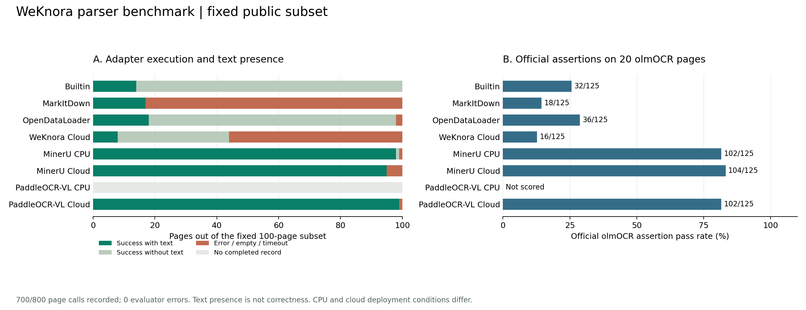

# 八解析引擎公开基准实验：过程快照

评分快照包含 700 / 800 个已归档逐页调用，100 个调用尚无完整记录。

本地服务使用中央处理器（Central Processing Unit，CPU）推理。完整调用记录的缺口：PaddleOCR-VL CPU 100 页。具有正式 OmniDocBench 标准指标的引擎为 7 / 8 个。人工签名完成 0 / 100 页，优先核验清单仍有 20 页待核验。

实验输入为固定的 100 页可移植文档格式（Portable Document Format，PDF）文件，包含 80 页 OmniDocBench 和 20 页 olmOCR-bench。其中 82 页没有文字层，18 页保留原始文字层。八个引擎接收相同字节，参考标注只进入评分程序。

测量对象为生产解析适配器返回的 Markdown，位置处于切块与下游光学字符识别（Optical Character Recognition，OCR）之前。接口执行状态、正文存在性与内容正确性分别记录；仅图片输出可能需要知识库处理流程中的图片识别。

图 1 同时展示固定分母的执行覆盖与官方断言分数。左图保留失败和缺少完整记录的页面；右图在条形末端标出断言通过数及评分分母。未完整覆盖 olmOCR 页面时，条形使用斜线并标记 partial，表示部分样本评分。

图中的“有文字”只检查去除图片引用后的正文是否存在。olmOCR-bench 分数由冻结的官方测试对象计算，覆盖文字、表格、阅读顺序与公式。该结果属于固定公开子集实验，不能作为完整官方排行榜成绩。

| 引擎 | 已执行页 | 接口成功页 | 有文字页 | 官方断言通过 / 已评分 | 微平均通过率 | 工具异常 | 平均请求秒数 |
|---|---:|---:|---:|---:|---:|---:|---:|
| Builtin | 100 | 100 | 14 | 32 / 125 | 25.60% | 0 | 0.11 |
| MarkItDown | 100 | 17 | 17 | 18 / 125 | 14.40% | 0 | 0.57 |
| OpenDataLoader | 100 | 98 | 18 | 36 / 125 | 28.80% | 0 | 1.16 |
| WeKnora Cloud | 100 | 44 | 8 | 16 / 125 | 12.80% | 0 | 70.15 |
| MinerU CPU | 100 | 99 | 98 | 102 / 125 | 81.60% | 0 | 22.21 |
| MinerU Cloud | 100 | 95 | 95 | 104 / 125 | 83.20% | 0 | 32.57 |
| PaddleOCR-VL CPU | 0 | 0 | 0 | 0 / 0 | 未评分 | 0 | 未执行 |
| PaddleOCR-VL Cloud | 100 | 99 | 99 | 102 / 125 | 81.60% | 0 | 60.75 |

表中接口错误仍属于已执行页面。官方断言工具异常单独记录，不按模型回答正确处理。未完成运行的分母可能不同；比较时需要核对已执行页数和断言数量。not_run 表示评分快照缺少完整结果记录，包含正在执行和尚未调用的页面。

## OmniDocBench 标准指标

80 页图像文档的标准评分使用冻结的官方代码。各引擎评分副本统一删除图片引用、替代文字及图片路径，原始结果保持完整。编辑距离越低表示差异越小；表格树编辑距离相似度（Tree Edit Distance based Similarity，TEDS）越高表示表格结构与内容越接近标注。各项均采用官方按页汇总口径，实际页数随相应标注是否存在而定。

| 引擎 | 文字编辑距离 / 页数 | 表格 TEDS / 页数 | 阅读顺序编辑距离 / 页数 | 公式字符串编辑距离 / 页数 |
|---|---:|---:|---:|---:|
| Builtin | 1.0000 / 78 | 0.00% / 17 | 1.0000 / 79 | 1.0000 / 9 |
| MarkItDown | 1.0000 / 78 | 0.00% / 17 | 1.0000 / 79 | 1.0000 / 9 |
| OpenDataLoader | 1.0000 / 78 | 0.00% / 17 | 1.0000 / 79 | 1.0000 / 9 |
| WeKnora Cloud | 1.0000 / 78 | 0.00% / 17 | 1.0000 / 79 | 1.0000 / 9 |
| MinerU CPU | 0.0818 / 78 | 85.71% / 17 | 0.1196 / 79 | 0.2547 / 9 |
| MinerU Cloud | 0.1177 / 78 | 85.71% / 17 | 0.1560 / 79 | 0.2547 / 9 |
| PaddleOCR-VL CPU | 待完成 | 待完成 | 待完成 | 待完成 |
| PaddleOCR-VL Cloud | 0.0366 / 78 | 79.02% / 17 | 0.0850 / 79 | 0.1874 / 9 |

公式字符检测匹配（Character Detection Matching，CDM）具有实际结果的引擎为 0 / 8 个，其运行需要独立的排版渲染依赖。公式字符串编辑距离和 olmOCR 公式断言各自按其定义解释，报告不提供官方综合分。

各引擎使用同一版本的评分输入清理函数，函数版本与输入输出摘要保存在评分清单中。该口径与完全原样 Markdown 的官方榜单提交存在区别。分母审计分别列出适用标注页、实际评分页以及空输出和服务错误页的纳入数量，缺失分数保持为空。

## 运行配置与解释范围

本地执行使用 CPU。MinerU 使用 pipeline 后端；PaddleOCR-VL 使用完整布局分析服务。云服务由现有租户配置指定，程序在内存中读取和解密凭据，各引擎只收到本引擎所需配置。

本地服务在模型下载及内容摘要校验完成后接受正式请求。单页冒烟调用承担模型冷启动验证。正式运行的本地引擎各为单并发，三个云端引擎各使用三个固定分片。八页冒烟输入包含于正式清单，云端是否采用缓存无法由响应确认。平均耗时反映该部署和网络条件下的实际请求，不构成算法计算速度排名。

本地应用程序接口（Application Programming Interface，API）调用费记为 0，硬件和电费未计入。云解析响应未提供可核对的逐页账单，费用保存为空值，待账单核验。OpenRouter 模型令牌价格对应模型调用，解析服务费用由实际解析提供方核对。

输入和结果使用安全散列算法 256 位（Secure Hash Algorithm 256-bit，SHA-256）记录内容身份。固定清单摘要为 `a15b83b63de6ed2bb8ce11f7c8299cec7b8f35e22054349897246b12c4cecc6e`。逐页记录保存输入摘要、运行代码身份、配置、开始时间、耗时、错误和输出摘要。

### 本机服务验证实测

下表读取各服务保存的单页验证记录。请求耗时包含服务推理和接口处理，内存峰值采用 Linux 控制组的累计峰值。GiB 表示 2 的 30 次方字节。

| 服务 | 验证样本 | 请求秒数 | 峰值内存 GiB | 返回字符数 | 资源限额 |
|---|---|---:|---:|---:|---|
| MinerU 3.4.5 pipeline | `omni-8739ae8d4f502788` | 22.043 | 1.834 | 717 | 验证记录未提供 |
| PaddleOCR-VL-1.6 | `omni-8739ae8d4f502788` | 478.938 | 8.566 | 647 | 6 个 CPU 核 / 9 GiB |

两个服务使用同一页教材样本，模型和服务实现各自固定。PaddleOCR-VL 的累计峰值包含初始化，其验证期间还有 MinerU 正式解析同时运行。这些单页测量支持说明当前机器的等待时间与内存需求，不能推导其他硬件上的吞吐量或等资源算法速度排名。验证记录未提供主机 CPU 型号和物理内存总量。

实测来源：[MinerU 验证记录](../../../deploy/parser-benchmark/mineru/validation.json)、[PaddleOCR-VL 验证记录](../../../deploy/parser-benchmark/paddle/validation.json)。模型版本、输入摘要、依赖版本和测量边界随原始记录保存。

### 运行身份与费用记录

基线可执行文件的实际 SHA-256 为 `8ab644eee861c75b4351c603b5f0b5c268725cb020b333a1b50f4de87b37cd40`，与运行身份记录一致。编译标签为 `86436db4+parser-benchmark`，可定位的源码提交为 `a39b8da71db088ff1bf6120f00966e8b1d0a7a96`。3 / 3 份归档源码通过字节摘要核对，3 / 3 份源码与该提交在换行符归一化后内容一致。

评分快照中的 700 份调用记录有 0 份包含逐页二进制摘要，700 份未包含该字段。独立二进制身份与逐页字段覆盖分别记录；现有逐页记录保持其原始内容。源码归档与二进制摘要用于定位运行材料，其验证范围不包含逐位一致的重新编译。

本快照纳入的请求开始时间范围为 `2026-09-11T08:20:28Z` 至 `2026-09-11T09:23:27Z`，使用协调世界时（Coordinated Universal Time，UTC）。生成时间与证据范围分别保存在结构化汇总中，正在执行且没有完整记录的请求不进入当前评分。

费用表使用当前评分快照中的原始调用记录。未提供费用的云调用保持未知，不并入一个伪精确的总金额。

| 引擎 | 纳入记录 | 有金额记录 | 费用未知记录 | 已记录 API 费用（美元） |
|---|---:|---:|---:|---:|
| Builtin | 100 | 100 | 0 | 0.00 |
| MarkItDown | 100 | 100 | 0 | 0.00 |
| OpenDataLoader | 100 | 100 | 0 | 0.00 |
| WeKnora Cloud | 100 | 0 | 100 | 未知 |
| MinerU CPU | 100 | 100 | 0 | 0.00 |
| MinerU Cloud | 100 | 0 | 100 | 未知 |
| PaddleOCR-VL CPU | 0 | 0 | 0 | 尚无调用记录 |
| PaddleOCR-VL Cloud | 100 | 0 | 100 | 未知 |

本地 API 金额 0 仅指没有外部接口调用费，不包含购置硬件、电费及运维时间。云服务的免费额度、折扣和实际扣款需账号账单核对。OpenRouter 的模型令牌价表不覆盖本实验中的外部文档解析服务费用。

## 人工核验清单

人工清单共有 100 页记录，已有 0 页具有完整人工签名，优先抽查清单中还有 20 页待核验。浏览器交互测试与程序审计不计作人工签名。核验者需填写实际姓名或标识、结论和备注。

| 优先页面 | 来源 | 人工检查内容 |
|---|---|---|
| `olm-ea799bf8a149ef10` | olmOCR-bench | 核对公式上下标、分数和符号；字符串指标不能证明数学等价；核对多栏阅读顺序及段落连接；确认图片引用没有被误算成已识别正文；查看失败或超时样本，区分权限、服务故障与解析质量；不同引擎的官方断言通过率差异较大 |
| `olm-181e6d4f9276a3bb` | olmOCR-bench | 核对公式上下标、分数和符号；字符串指标不能证明数学等价；核对多栏阅读顺序及段落连接；查看失败或超时样本，区分权限、服务故障与解析质量；不同引擎的官方断言通过率差异较大 |
| `olm-2e73e2911dc7c43a` | olmOCR-bench | 核对公式上下标、分数和符号；字符串指标不能证明数学等价；核对多栏阅读顺序及段落连接；查看失败或超时样本，区分权限、服务故障与解析质量；不同引擎的官方断言通过率差异较大 |
| `olm-5eccf8f44171af5f` | olmOCR-bench | 核对表格单元格归属、跨行跨列及数字；核对多栏阅读顺序及段落连接；查看失败或超时样本，区分权限、服务故障与解析质量；不同引擎的官方断言通过率差异较大 |
| `olm-927b06801c66168b` | olmOCR-bench | 核对多栏阅读顺序及段落连接；确认图片引用没有被误算成已识别正文；查看失败或超时样本，区分权限、服务故障与解析质量；不同引擎的官方断言通过率差异较大 |
| `olm-9c742aacf5c7d0fb` | olmOCR-bench | 核对多栏阅读顺序及段落连接；确认图片引用没有被误算成已识别正文；查看失败或超时样本，区分权限、服务故障与解析质量；不同引擎的官方断言通过率差异较大 |
| `olm-b37396b7ab41ca9a` | olmOCR-bench | 核对多栏阅读顺序及段落连接；确认图片引用没有被误算成已识别正文；查看失败或超时样本，区分权限、服务故障与解析质量；不同引擎的官方断言通过率差异较大 |
| `olm-c927a4e48c288a6d` | olmOCR-bench | 核对公式上下标、分数和符号；字符串指标不能证明数学等价；核对多栏阅读顺序及段落连接；确认图片引用没有被误算成已识别正文；不同引擎的官方断言通过率差异较大 |
| `olm-db5bdbb8bbdb7e2c` | olmOCR-bench | 核对表格单元格归属、跨行跨列及数字；核对多栏阅读顺序及段落连接；查看失败或超时样本，区分权限、服务故障与解析质量；不同引擎的官方断言通过率差异较大 |
| `omni-0d19c70b3af01e9e` | OmniDocBench | 核对表格单元格归属、跨行跨列及数字；核对多栏阅读顺序及段落连接；确认图片引用没有被误算成已识别正文；查看失败或超时样本，区分权限、服务故障与解析质量 |
| `omni-14c6a4472f5f5620` | OmniDocBench | 核对表格单元格归属、跨行跨列及数字；核对多栏阅读顺序及段落连接；确认图片引用没有被误算成已识别正文；查看失败或超时样本，区分权限、服务故障与解析质量 |
| `omni-2c0a083b9bb9d973` | OmniDocBench | 核对表格单元格归属、跨行跨列及数字；核对多栏阅读顺序及段落连接；确认图片引用没有被误算成已识别正文；查看失败或超时样本，区分权限、服务故障与解析质量 |
| `omni-32e5bafb46304cc6` | OmniDocBench | 核对公式上下标、分数和符号；字符串指标不能证明数学等价；核对多栏阅读顺序及段落连接；确认图片引用没有被误算成已识别正文；查看失败或超时样本，区分权限、服务故障与解析质量 |
| `omni-3f305d6f3536a837` | OmniDocBench | 核对公式上下标、分数和符号；字符串指标不能证明数学等价；核对多栏阅读顺序及段落连接；确认图片引用没有被误算成已识别正文；查看失败或超时样本，区分权限、服务故障与解析质量 |
| `omni-53210aec0d383720` | OmniDocBench | 核对表格单元格归属、跨行跨列及数字；核对多栏阅读顺序及段落连接；确认图片引用没有被误算成已识别正文；查看失败或超时样本，区分权限、服务故障与解析质量 |
| `omni-5ac81d8e009837d3` | OmniDocBench | 核对公式上下标、分数和符号；字符串指标不能证明数学等价；核对多栏阅读顺序及段落连接；确认图片引用没有被误算成已识别正文；查看失败或超时样本，区分权限、服务故障与解析质量 |
| `omni-5b0636ee741c7509` | OmniDocBench | 核对表格单元格归属、跨行跨列及数字；核对多栏阅读顺序及段落连接；确认图片引用没有被误算成已识别正文；查看失败或超时样本，区分权限、服务故障与解析质量 |
| `omni-5f439f25e08573b9` | OmniDocBench | 核对表格单元格归属、跨行跨列及数字；核对多栏阅读顺序及段落连接；确认图片引用没有被误算成已识别正文；查看失败或超时样本，区分权限、服务故障与解析质量 |
| `omni-92b83947159fe7ce` | OmniDocBench | 核对表格单元格归属、跨行跨列及数字；核对多栏阅读顺序及段落连接；确认图片引用没有被误算成已识别正文；查看失败或超时样本，区分权限、服务故障与解析质量 |
| `omni-973f1686e4dce325` | OmniDocBench | 核对表格单元格归属、跨行跨列及数字；核对多栏阅读顺序及段落连接；确认图片引用没有被误算成已识别正文；查看失败或超时样本，区分权限、服务故障与解析质量 |

人工核验工作台提供原文预览、官方标注、八引擎原始输出和记录导出。建议先核对表格数字、公式符号、多栏顺序及中英混排空格，再核对失败页和自动评分与人眼判断不一致的页。服务故障核验与内容审核分别记录。

人工事项还包括核对三个云解析账号的实际账单、查看 WeKnora Cloud 的超时及响应消息上限说明，以及在对外发布原始文档前核对来源使用条款。程序可以提供错误样本和请求证据；账号账单确认、厂商支持沟通和人工签名由实际账号持有人完成。

## 来源与复现

数据版本、抽样规则、官方评分入口与许可说明见 [公开基准子集说明](../../parser-benchmark-dataset.md)。固定来源为 [OmniDocBench](https://github.com/opendatalab/OmniDocBench) 与 [olmOCR-bench](https://github.com/allenai/olmocr/tree/main/olmocr/bench)。

原始运行目录：`artifacts/parser-benchmark/runs/baseline-v1`。本报告的结构化汇总为 [summary.json](summary.json)。公开原文、参考内容、原始解析结果和模型文件存放于 Git 忽略目录，代码仓库保存清单、摘要、方法、汇总和图表。
