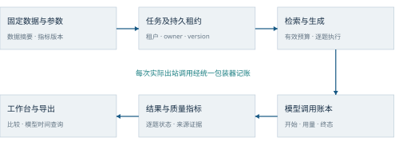
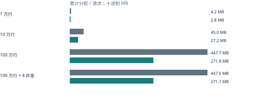
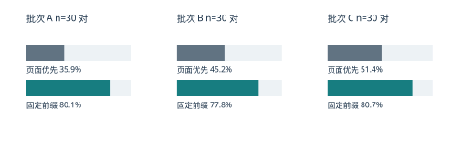
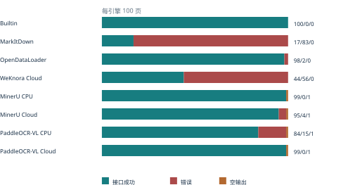
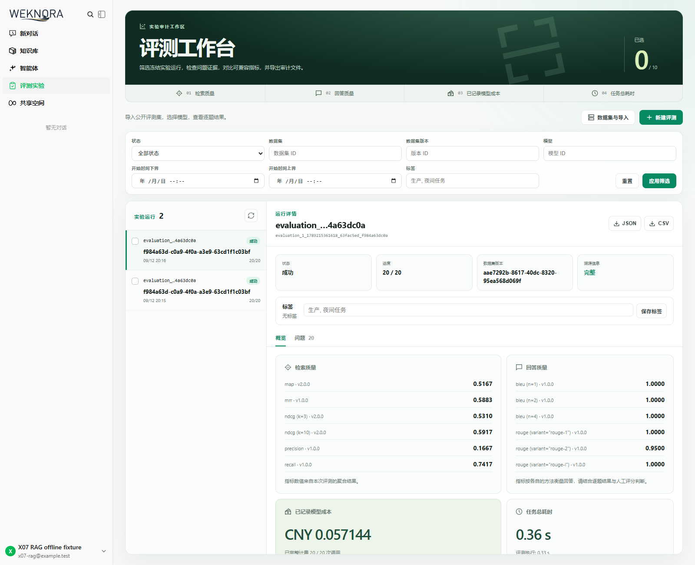

# 质量评测基线与成本可观测

WeKnora · 腾讯犀牛鸟课题三技术报告

刘蔚霖　南开大学　GitHub：Aokiuuz

源码提交：ad3330d549adc2c17d0193d22dcdcecf69a7ab12

系统在 WeKnora 中提供持久化评测工作台、模型逐调用账本、按模型与时间查询的用量面板、持久化嵌入缓存和 Wiki 固定前缀提示词。数据集、模型配置、指标版本和运行源码随实验冻结，逐题结果支持比较及导出。

确定性工程验收中，重建索引的嵌入调用由冷轮 25 次降为热轮 0 次；两轮各完成 20 题和 20 次生成调用。对生产排名融合施加真实召回退化后，门禁报告 recall=0 并以退出码 1 拒绝。

| 证据层 | 规模 | 适用范围 |
| --- | --- | --- |
| 工程验证 | Go 9,259 通过 / 33 跳过；前端 921 通过 | 准确源码下的契约、迁移、缓存、故障恢复和构建 |
| 实际模型实验 | 600 个问题 × 2 个模型；另有 4 组检索实验 | 固定公开子集的已观察结果 |
| Wiki 配对实验 | 3 批 × 30 对 | 供应商缓存令牌、费用与延迟分别统计 |
| 八解析引擎 | 100 份相同文档 × 8 | 636 成功、160 错误、4 空输出，全部保留分母 |

成果覆盖固定评测、质量回归、模型统计与两类缓存。前端通过 921 项测试、34 个中英文布局场景和 5 项实际按钮操作；完整后端验收对应 1cc446d，当前三个组件的模板与脚本与该基线一致。实验版本和指标口径见 versions.json 与 EXPERIMENTS.md。

项目仓库：https://github.com/Aokiuuz/WeKnora
完整功能贡献：https://github.com/Tencent/WeKnora/pull/3220
要求闭合：ACCEPTANCE.md；复现：REPRODUCE.md。

# 源要求与验收路径

《WeKnora 开源实战课题》和《WeKnora 腾讯犀牛鸟课题实战流程指引 2026》定义功能、验收与提交格式。六项必做任务、四项核心验收和八引擎选做分别通过 T1–T6、A1–A4 和 O1 关联实现与证据。

持续集成 CI（Continuous Integration）运行自动检查；结构化导出采用 JSON（JavaScript Object Notation）和 CSV（Comma-Separated Values）。安全散列算法 SHA-256（Secure Hash Algorithm 256-bit）标识输入、输出和归档字节。

| 编号 | 源要求 | 实际入口 |
| --- | --- | --- |
| T1 | 固定数据集、模型与分块参数，结果入库 | 实验快照、版本化数据集、租户任务、逐题结果 |
| T2 | 每轮检索准确性、答案质量、成本与耗时 | 冻结指标计划、调用账本、工作台和导出 |
| T3 | 定时 CI 与退化阻断合并 | 回归和性能工作流；分支必需检查 |
| T4 | 每次模型调用记录与模型页展示 | modelobs、model_statistics、模型用量面板 |
| T5 | 相同文本与模型复用嵌入 | modelcache、持久存储、共享请求协调 |
| T6 | 固定提示词在前，可变内容在后 | Wiki 提示词组装和配对缓存实验 |

| 验收 | 验证动作 | 预期 |
| --- | --- | --- |
| A1 单命令 | 干净准确提交运行 make evaluation-verify | 退出 0；13 项固定指标及服务验证通过 |
| A2 真退化 | 生产融合路径只保留最差候选 | 服务召回下限失败，退出 1，指出 recall |
| A3 模型统计 | 实际界面切换模型及时间窗口 | 界面查询数据库，过滤条件与返回一致 |
| A4 两类缓存 | 嵌入重建与 Wiki 配对比较 | 25→0 嵌入；三批缓存令牌和费用对照 |

选做 O1 包含八解析适配器、统一输入清单和失败感知评分。输入是 100 份相同可移植文档格式 PDF（Portable Document Format）文件，输出包括逐页状态、文本、阅读顺序、表格和公式字符串的机器评分。源要求的名称、摘要及逐项对应见 ACCEPTANCE.md。

# 评测生命周期与租户隔离

评测以租户、数据版本和实验快照为边界。创建入口冻结数据摘要、模型配置指纹、检索参数、生成预算及指标算法版本。执行器认领持久租约，调用检索和生成，再保存逐题结果。图 1 展示主要数据流。

图 1　实验身份、逐题结果与调用账本的数据流。界面与导出读取持久结果；来源摘要连接运行配置与结果。



心跳维持任务租约；写入和终态发布同时检查租户、持有者、版本与有效期。取消状态先持久化，再中止本地工作；失效持有者不能覆盖新持有者的状态。资源清理核对知识库、文档和租户绑定，并在有界的独立上下文中执行。

| 状态 | 编码 | 含义 |
| --- | --- | --- |
| pending / running | 0 / 1 | 待执行或租约有效的执行状态 |
| success / failed / timed_out | 2 / 3 / 4 | 完成、失败或超时 |
| interrupted / canceled | 5 / 6 | 失效租约回收后的中断，或持久取消 |

进程终止后的恢复负责回收失效任务、清理资源并发布中断或取消终态。恢复以资源清理和终态发布为完成条件。超文本传输协议 HTTP（Hypertext Transfer Protocol）故障实验验证取消、重复取消及进程终止后的状态 6 和 5。

# 指标、来源与回归门禁

指标计划冻结算法键、版本及参数。检索指标包括准确率 Precision、召回率 Recall、平均倒数排名 MRR（Mean Reciprocal Rank）、归一化折损累计增益 NDCG（Normalized Discounted Cumulative Gain）和平均准确率均值 MAP（Mean Average Precision）。答案指标包括 BLEU、ROUGE、完全匹配 EM（Exact Match）及词面 F1（词级准确率与召回率的调和平均）。BLEU 为 Bilingual Evaluation Understudy；ROUGE 为 Recall-Oriented Understudy for Gisting Evaluation。

| 固定指标 | 冻结值 |
| --- | --- |
| generation.bleu.n1 | 0.577880078307 |
| generation.bleu.n2 | 0.587072574594 |
| generation.bleu.n4 | 0.617652476271 |
| generation.exact_match | 0.5 |
| generation.rouge.rouge-1 | 0.4999999975 |
| generation.rouge.rouge-2 | 0.4999999975 |
| generation.rouge.rouge-l | 0.4999999975 |
| retrieval.map | 0.75 |
| retrieval.mrr | 1 |
| retrieval.ndcg.k10 | 0.913117328564 |
| retrieval.ndcg.k3 | 0.913117328564 |
| retrieval.precision | 0.5 |
| retrieval.recall | 0.75 |

固定响应门禁使用两题、种子 42 和并发 1，对 13 项数值按冻结容差比较。完整服务门禁使用 20 题、24 段语料和 32 维合成嵌入，检索召回下限为 0.7416666666666666，NDCG@3 下限为 0.5310068874168308。两层覆盖对象不同，分别保留数据和分母。

实际退化探针修改生产排名融合，仅保留最差候选，使 HTTP 门禁返回 recall=0 below frozen minimum，退出码为 1。探针恢复后源码摘要一致；适用函数与阈值在提交版本中保持相同字节。运行记录还拒绝缺失源码身份的服务二进制。

lint 在完整 Git 检出上以合并请求 PR（Pull Request）的目标提交计算新增诊断，避免托管差异接口的文件数限制。新增缺失导出说明的函数会使检查退出 1，验证记录保留临时负例与恢复结果。

# 缓存身份与费用可观测

嵌入缓存身份包含租户、模型标识、影响模型行为的配置指纹、请求选项摘要及文本摘要。读取检查向量维度与有限数值。共享执行协调内部再次读取持久缓存，已填充项直接复用，只将剩余文本发送到供应商，避免先前未命中读与另一轮写入交错造成重复调用。

| 检查 | 结果 | 验证口径 |
| --- | --- | --- |
| 完整服务持久复用 | 冷轮 25 次嵌入，热轮 0 次 | 两轮各 20 次生成，检索质量一致 |
| 并发未命中交错 | 100 次重复，400 个测试/子测试完成 | 缓存与调用账本竞态测试另有 34 项通过 |
| 异常存储恢复 | 向量仍返回，告警只含固定类别及数量 | 存储失败保留独立告警状态 |
| 生成输出预算 | 同时设置两种上游长度字段 | 冻结实际有效预算，实际出站请求验证为 256 |

模型调用包装器保存开始和终态、实际令牌用量、供应商缓存字段、应用缓存状态、模型配置摘要和价格版本。金额使用整数微货币单位并区分币种；供应商报告金额、价格估算和缺失值具有不同身份。普通业务请求采用最佳努力记账，严格评测将记账失败传播为失败。

供应商缓存读取令牌比例使用提示词令牌作分母；应用嵌入缓存比例使用查询事件作分母。未知缓存字段保留缺失。流式 Anthropic 响应保留工具分片索引和实际用量；缺少正常结束标记的流保留不完整状态。

## 共享累计费用

金额单位为美元（United States Dollar，USD）。

| 项目 | 数量 |
| --- | --- |
| 累计授权上限 | USD 20 |
| 已报告费用 | USD 0.922374105923 |
| 未结算预留 | USD 0.728884 |
| 费用与预留合计 | USD 1.651258105923 |
| 账本记录 / 未知费用记录 | 2964 / 32 |
| 当前适配新增付费请求 | 0 |

费用表采用共享累计账本口径，已知费用与预留分别统计。三种云解析接口的 300 条逐页费用为未知值，实际云账单合计仍为未知。

# 精确分位数的规模观测

模型统计按租户、模型和时间从数据库聚合。延迟读取使用行流并保存数值样本，精确分位数按线性插值计算。样本存储与排序的资源使用随行数增长，查询时间窗口上限为 366 天；容量参数包含行数和并发数。图 2 对比同一合成工作负载下的累计内存分配，单位为兆字节 MB（Megabyte，100万字节）。

图 2　相同 SQLite 输入、Go 1.26 和 GOMAXPROCS=2 下的观测。灰色为被比较的行集合读取，绿色为当前行流读取；数值为每请求累计内存分配。



| 行数 / 并发 | 行集合耗时 | 行流耗时 | 测量单位 |
| --- | --- | --- | --- |
| 1 万 / 1 | 30.9 ms | 27.5 ms | 每批一次查询 |
| 10 万 / 1 | 297.6 ms | 268.4 ms | 每批一次查询 |
| 100 万 / 1 | 3.361 s | 2.728 s | 每批一次查询 |
| 100 万 / 4 | 6.295 s | 4.790 s | 整批四次并发查询 |

数据库准备在测量区间之外。每个点测量一次，检查记录数和精确中位数 499.5；同一测试代码摘要与两份生产文件摘要随证据保存。测量结果适用于所列本机环境、行数及并发条件。

```sh
GOMAXPROCS=2 GOMEMLIMIT=2GiB go test -tags sqlite_fts5 \
  ./internal/application/repository -run '^$' \
  -bench BenchmarkModelStatisticsScale -benchtime=1x -count=1
```

仓库提供可复现的规模基准，按记录数和精确中位数校验结果。行流读取在所列规模下减少累计内存分配，并保持精确分位数口径。

# 实际问答实验与失败分析

原始上下文读者实验覆盖中文阅读理解数据集 CMRC2018（Chinese Machine Reading Comprehension 2018）、含无答案问题的 SQuAD2（Stanford Question Answering Dataset 2.0）和多跳问答数据集 HotpotQA。每个数据集每模型 200 题，合计 1200 份回答。该实验直接提供原文上下文，评价给定上下文的答案生成质量。

| 数据集 | 模型 | EM | F1 | 格式无效 |
| --- | --- | --- | --- | --- |
| cmrc | DeepSeek V4 Flash | 0.685 | 0.906 | 1 |
| cmrc | Kimi K2.5 | 0.725 | 0.923 | 1 |
| squad | DeepSeek V4 Flash | 0.555 | 0.628 | 0 |
| squad | Kimi K2.5 | 0.500 | 0.571 | 0 |
| hotpot | DeepSeek V4 Flash | 0.565 | 0.648 | 0 |
| hotpot | Kimi K2.5 | 0.635 | 0.738 | 4 |

多参考答案取最高机器分；格式无效与调用失败记零并保留分母。同一原文中的问题具有相关性，预训练数据重叠未知。样本身份为已观察的公开子集；EM 和 F1 评价答案词面匹配，人工评分记录为空值。

| 失败对象 | DeepSeek | Kimi | 分母 |
| --- | --- | --- | --- |
| HotpotQA 可答误拒 | 28 | 20 | 各 200 道可答题 |
| SQuAD2 无答案误答 | 57 | 71 | 各 100 道无答案题 |

失败类别由互斥规则重算，定位可答误拒和错误前提接受等现象。源码身份为 86436db4cecf13039b9a41ff8c78ac1fac8fff58，回答与规则结果见 data/reader-scores.json。

## 完整检索增强生成实验

检索增强生成 RAG（Retrieval-Augmented Generation）实验包含两个数据集、两个模型，每组 50 题和 500 段语料。CMRC 两模型召回均为 1.00，SQuAD2 均为 0.98，后者在本实验单相关标签下对应 49/50。一次空输出与两次未知费用保留；轮次工作者数量为 1 或 4，耗时不直接用于模型排名。

完整 RAG 实验对应源码 d0535cdfb4784ebc8cee73dccdf35c3489555a90；逐题结果保留运行配置、检索证据和调用账本。

# Wiki 固定前缀配对实验

Wiki 生成将共享资料与固定指令置于前部，页面变化内容置于后部。三批各 30 对请求固定供应商路由并交替组别顺序。图 3 展示缓存读取令牌总数除以提示词令牌总数，分母包含每组全部 30 次请求。

图 3　三批固定前缀组均具有更高的供应商缓存读取令牌占比。该指标的分母为令牌，不是请求命中与否的二元计数。



| 批次 | 读取令牌平均增加 | 总费用比 | 中位耗时比 |
| --- | --- | --- | --- |
| A | 1527.7 | 0.533 | 0.966 |
| B | 1130.1 | 0.619 | 0.979 |
| C | 1016.2 | 0.631 | 1.178 |

费用比与耗时比均为固定前缀组除以页面优先组。三批固定前缀费用分别为对照的 53.3%、61.9%、63.1%；第三批中位耗时为对照的 1.178 倍。结果支持固定条件下的缓存和费用收益，延迟变化单独解释。

同批请求共享供应商缓存状态，配对具有相关性。四项字符串检查评价指定词语的覆盖情况。逐对数据见 data/wiki-pairs.json；实验来源与计划摘要见 data/experiment-provenance.json。逐批执行身份按原始记录字段登记。

# 八解析引擎横向基线

解析基线固定 100 份 PDF（Portable Document Format，可移植文档格式）：80 页 OmniDocBench 和 20 页 olmOCR-bench。82 页没有文字层，18 页保留文字层；参考标注仅进入评分器。八个引擎接收相同输入字节，图 4 显示 800 条结果的状态。

图 4　成功 / 错误 / 空输出的逐引擎分布。每行分母均为 100；接口状态、正文覆盖和内容质量分别统计。CPU 为中央处理器（Central Processing Unit），Cloud 表示云端接口。



按图中顺序，具有正文的页数为 14、17、18、8、98、95、84、99，分母均为 100。olmOCR 官方断言通过数为 32、18、36、16、102、104、82、102，分母均为 125。

Paddle CPU 批次执行及五步后处理为 complete，100 条结果均已归档，其中 84 成功、15 错误、1 空输出。100 份 PDF、800 条输入输出摘要及父清单与分片成员均通过一致性核验。

执行二进制 SHA-256 为 8ab644eee861c75b4351c603b5f0b5c268725cb020b333a1b50f4de87b37cd40，归档源码为 a39b8da71db088ff1bf6120f00966e8b1d0a7a96。当前工具构建、输入完整性与离线评分验证通过；逐页结果绑定上述执行身份。

# 解析质量与上游兼容性

OmniDocBench 评分副本统一删除图片引用、替代文字和路径，原始输出保持完整。文字和阅读顺序采用编辑距离；表格采用 TEDS（Tree Edit Distance based Similarity，树编辑距离相似度）。评分表采用上述统一预处理后的输入。

| 引擎 | 文字距离 /78 | 表格 TEDS /17 | 顺序距离 /79 | 公式字符串 /9 |
| --- | --- | --- | --- | --- |
| Builtin | 1.0000 | 0.00% | 1.0000 | 1.0000 |
| MarkItDown | 1.0000 | 0.00% | 1.0000 | 1.0000 |
| OpenDataLoader | 1.0000 | 0.00% | 1.0000 | 1.0000 |
| WeKnora Cloud | 1.0000 | 0.00% | 1.0000 | 1.0000 |
| MinerU CPU | 0.0818 | 85.71% | 0.1196 | 0.2547 |
| MinerU Cloud | 0.1177 | 85.71% | 0.1560 | 0.2547 |
| PaddleOCR-VL CPU | 0.1527 | 65.12% | 0.2019 | 0.2021 |
| PaddleOCR-VL Cloud | 0.0366 | 79.02% | 0.0850 | 0.1874 |

解析结果提供文本、表格、阅读顺序和公式字符串四类机器指标，以及 olmOCR 逐项断言。文字、顺序和公式字符串距离越低越好，TEDS 越高越好；各列保留自己的有效标注分母。完整评分状态与来源清单见 EXPERIMENTS.md。

## 上游接口与数据库兼容性

集成基础为 Tencent/WeKnora main 的 462999ec3f5c1467ef0ccf5cf8c422393f40a0e6。HTTP 请求与服务器发送事件 SSE（Server-Sent Events）共享上游认证刷新协调器，各调用者保留自己的取消信号。Anthropic 工具流索引、完成预算和缓存字段保持当前协议。模型设置使用上游图标包，新增界面字符串覆盖五种语言。

SQLite 基础迁移为 14，PostgreSQL 基础迁移为 93，课题迁移为独立 16。实际升级探针验证租户、模型、数据集、语料、问题和相关标签的保留；重复迁移检查幂等。部署流程包括数据库备份、迁移和目标版本验证。

解析工具仅通过显式配置文件或标准输入接收凭据。构建验证嵌套分词字典和完整来源提交，离线验证无需解析服务或云账号。可选 PDF 完整性验证与无数据下载的单元检查分别提供命令。

# 独立验证与界面证据

工程证据将测试、运行二进制和源码分开记录。完整 Go 套件为 9,259 通过、33 跳过、零失败；数据库迁移矩阵另外完成 64 项通过，缓存记账竞态检查 34 项通过。前端 921 项、类型检查和生产构建通过。每项适用版本及文件等价判断见 versions.json 和 EXPERIMENTS.md。

图 5 使用真实本地前后端和合成供应商展示实验详情。界面检查覆盖持久运行、逐题结果、导出、比较及模型时间过滤；中英文另有 34 个布局场景，窄窗口实际完成 5 次导出及比较操作。

图 5　工作台工程夹具示例。界面采用合成供应商和合成价格，展示逐题结果及账本对账。



浏览器后端为 d1fedd6，前端为 c7b47a13 并与当前集成前端字节一致。完整后端验收绑定 1cc446d；三个组件仅有样式变化，模板与脚本相同。Apple M4 平台证据对应 1776aa442a491f1657196ca21da914bab197b17c；当前适配的工程验证环境为 Linux 与 CI。

# 成果验收与复现入口

课题成果包括固定配置的持久评测、检索与答案指标、模型调用账本、模型及时间统计、两类缓存和回归门禁。六项必做任务、四项核心验收与八解析引擎基线的对应关系见 ACCEPTANCE.md。

在干净克隆中签出 versions.json 的完整 code_commit，安装 Go 1.26、C/C++ 工具链、Python 3.11+ 和 GNU Make，然后运行：

```sh
make evaluation-verify
```

预期退出码为 0，verification-summary.json 的 status 为 passed，paid_provider_requests 为 0。该命令建立合成供应商和隔离数据，执行固定指标、公开数据、冷热嵌入缓存、任务取消与租约恢复、费用字段、离线解析及源码身份检查。

| 验收内容 | 结果与复现观察 |
| --- | --- |
| 固定流程与质量指标 | 配置和数据版本冻结；13项指标按冻结值比较 |
| 退化阻断 | 生产检索召回退化至0，门禁退出1并指出recall |
| 模型统计与交互 | 数据库模型及时间筛选；921项前端测试、34布局场景和5项按钮操作 |
| 缓存对照 | 完整服务嵌入调用25→0；三批Wiki费用、缓存令牌和耗时配对 |
| 八引擎解析 | 同批100份PDF、800条状态及文字/表格/顺序/公式字符串评分 |

完整后端运行对应 1cc446d；当前提交的三个前端组件模板与脚本与该基线一致。真实模型、解析和设备实验采用各自执行身份，版本映射见 versions.json；测量定义与统计分母见 EXPERIMENTS.md。

| 附件内容 | 阅读用途 |
| --- | --- |
| TECHNICAL-REPORT.pdf | 系统架构、实现机制、实验图表和结果 |
| README.md / ACCEPTANCE.md | 成果概览与源要求逐项对应 |
| REPRODUCE.md | 环境、单命令复现和界面查看步骤 |
| EXPERIMENTS.md / data/ | 样本、指标、费用、执行版本和实验数据 |
| versions.json / checksums.sha256 | 准确代码身份与成果附件完整性 |

代码仓库：https://github.com/Aokiuuz/WeKnora；完整提交：ad3330d549adc2c17d0193d22dcdcecf69a7ab12
